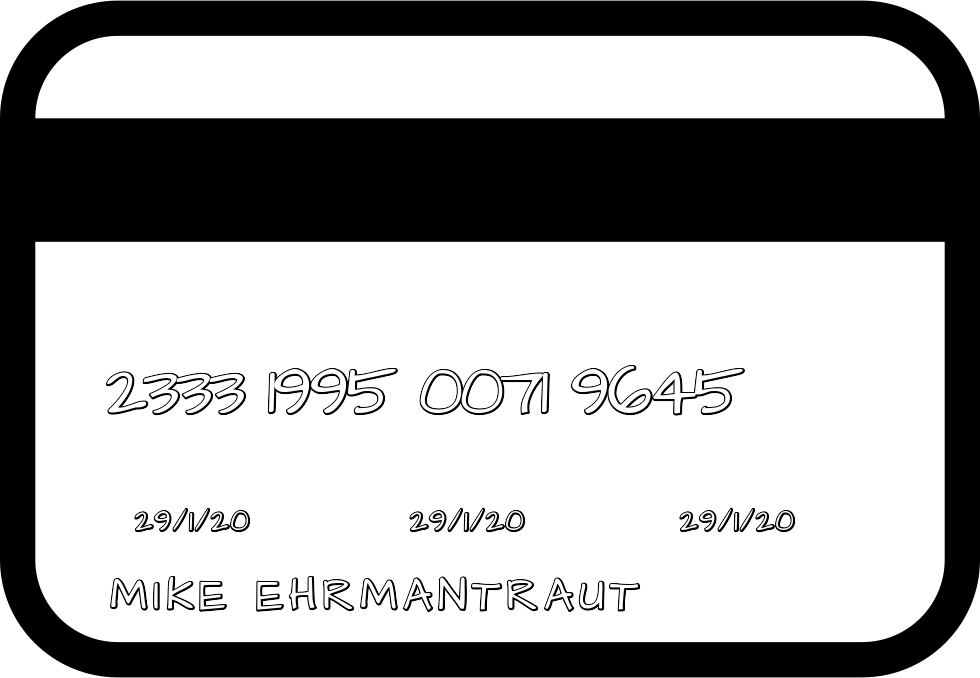

# Creating custom AWS Lambda Layers from scratch: obtaining ImageMagick with Freetype support

## TL;DR

Within one of my AWS Lambda functions, I needed to leverage of ImageMagick in order to perform some transformations on the input image received by the Lambda function. But, in my specific use case, I also have to deal with special fonts, adding strings onto the image.
Even if it exists a widespread [ImageMagick Layer](https://github.com/serverlesspub/imagemagick-aws-lambda-2) among AWS Lambda shared layers, it lacks of `freetype` support, the libraries which add a font engine, so it was not usable at all.
In this post I will describe how create from scratch a usable AWS Lambda layer for ImageMagick with freetype support.

`Note`: when creating a layer keep in mind that it will contribute to the final size of package to be deployed. In other words, you should focus on size even for layers, as they will steal space from your real function code. Cfr. [AWS Lambda limits](https://docs.aws.amazon.com/lambda/latest/dg/gettingstarted-limits.html "AWS Lambda limits").

## Intro

When creating serverless functions in AWS Lambda, one of the best feature is the opportunity to create `layers`. They are supposed to contain static dependencies used by a function that generally do not change over the time. The practical scenario is the possibility to store dependencies without the need of re-upload them, each time the function is modified.

## Use Case: generating an image containing a card layout with customized written

Starting from a given layout image (similar to the one of a credit card), ImageMagick will be in charge to add customized written for a given requesting user. The final result is something like that:

|  |
| :--: |

### Custom AWS Lambda Layer configuration

An AWS Lambda layer can be created an uploaded as a zip archive onto AWS Lambda by selecting from AWS console: Lambda > Layers > Create (button on top right corner).
Basically the archive uploaded is expecting a folder structure containing a `bin/` root folder where the requested binaries will be found by the AWS Lambda function. Of course the compiled binaries must be completely static as the will be deployed in a similar-AWS-Linux-Ami where the Lambda function will be triggered.

`Tip`: The process may be also automated using Cloud Formation, but this is outside the scope of this post.

## Compiling

I collected all the commands used below in a script (`compile_im.sh`), so that you may call all of them in one shot. I will run this commands against an AWS Linux AMI, so based on CentOS. I have also tried to launch the same commands in an Ubuntu-based AMI, and nothing change on the final result.
However I prefer to pick an CentOS-like AMI because apparently is a more close environment to the one where the layer will be run into.

### Prerequisites

Check that the following tools / lib are installed on compiling machine:

* compiling tools (aka `Build Essentials` on Debian/Ubuntu)
* pkgconfig
* zlib

This is for CentOS/RHEL:

    sudo yum groupinstall -y "Development Tools"
    sudo yum install -y zlib-devel pkgconfig

or in a single shot:

    sudo sh -c 'yum update -y && yum -y install zlib-devel pkgconfig && yum groupinstall -y "Development Tools"'

This is the same for Ubuntu/Debian

    sudo apt install -y build-essentials zlib1g-dev pkg-config

Then I will create a target directory in the home folder named `im`

    mkdir $HOME/im && cd im

`Note`: All the following commands will be run inside `im` folder. Whether you are using Ubuntu remember that the reference home folder should be intended as `/home/ubuntu` for all the following commands, whereas in a Linux AMI the home folder is headed to `/home/ec2-user`.

### Installing dependencies, aka delegates

The next step is installing all dependencies lib the will be available in ImageMagick, aka `delegates`.
The compilation of ImageMagick is smart enough to go through all available dependencies, whether they are met, they will be included, otherwise they will be simply left apart.
In this specific case we will compile all libraries from sources but in `static` fashion.

`Tip` Remember that we want all the binaries to be statically compiled so also the dependencies will be statically linked.

In this case I decided to include the following dependencies:

* libpng
* libjpeg
* libfreetype

You can add more, the point here is that I want to achieve an *ImageMagick with freetype engine support*. So `libfreetype`is a must-have, this in turns depends from `libpng`. For sake of completeness I also included `libjpeg`.

First of all we need to compile (statically) libpng and libjpeg which basically do not have any extra dependencies.

    # libpng
    wget -qO- http://prdownloads.sourceforge.net/libpng/libpng-1.6.37.tar.gz | tar xfvz -
    cd libpng-1.6.37
    ./configure --disable-shared --disable-dependency-tracking --prefix=$HOME/im/compiled/delegates
    make && make install && cd ..

    # libjpeg
    wget -qO- http://ijg.org/files/jpegsrc.v9d.tar.gz | tar xfvz -
    cd jpeg-9d
    ./configure --disable-shared --disable-dependency-tracking --prefix=$HOME/im/compiled/delegates
    make && make install && cd ..

Now that we have this done, we need to compile `freetype`, the steps are more or less the same. The main difference is that the lib is dependent from `libpng` so we have to provide at configuration time the reference for to previously statically linked libs and additional metadata info generated for `pkg-config`.

    # libfreetype
    wget -qO- http://download.savannah.gnu.org/releases/freetype/freetype-2.10.1.tar.gz | tar xfvz -
    cd freetype-2.10.1
    PKG_CONFIG_PATH="$HOME/im/compiled/delegates/lib/pkgconfig/" LDFLAGS="-L$HOME/im/compiled/delegates/lib" ./configure --disable-shared --disable-dependency-tracking --prefix=$HOME/im/compiled/delegates
    make && make install && cd ..

`Tip`: compiling can be more than often frustrating. You may encounter errors, especially typo derived from keeping on copy/pasting like your keyboard is the trigger of a rifle. Or either missing stuff where you need to Google back and forth for an issue you went through.
My advice is working smoothly, so if you are willing to step back from a compilation (even to try that it definitely works), remember to do a `make clean` or simply to delete target folder before recompiling. And of course take note of the commands that work after attempting several times different variants.

### Compiling ImageMagick with freetype support

Now compiling `ImageMagick` become pretty straightforward, all you need to do is a good configuration step that of course enables the freetype engine.

Here is mine:

    PKG_CONFIG_PATH="$HOME/im/compiled/delegates/lib/pkgconfig/" LDFLAGS="-L$HOME/im/compiled/delegates/lib" CPPFLAGS="-I$HOME/im/compiled/delegates/include -I$HOME/im/compiled/delegates/include/freetype2" ./configure \
    --enable-shared=no \
    --enable-static \
    --enable-delegate-build \
    --disable-dependency-tracking \
    --without-modules \
    --without-perl \
    --without-x \
    --without-magick-plus-plus \
    --enable-hdri=no \
    --disable-docs \
    --with-jpeg=yes \
    --with-png=yes \
    --with-xml=yes \
    --with-freetype=yes

With this we basically want to achieve three goals:

1. include libfreetype dependency (ImageMagick will refer to them as `delegates`)

       --with-freetype=yes

2. create a static binary

       --enable-shared=no \
       --enable-static \
       --enable-delegate-build \
       --disable-dependency-tracking \

3. generate a footprint small enough to be used as AWS Lambda Layer.

       --without-modules \
       --without-perl \
       --without-x \
       --without-magick-plus-plus \
       --disable-docs \

`NOTE`: the previously compiled lib where pretty minimal and relatively simple to be compiled. ImageMagick is complex and plenty of configurable options. I am sure that this configuration can be improved, especially to achieve a fully minimised compiled folder.

If linking of freetype is correct, at the end of this step, you should find something like:

    FreeType          --with-freetype=yes    yes

Before proceeding forward there is a further step. The headers generated from `freetype` are not soft linked in the main `include` folder. So I had to add explicitly their path in the CPPFLAGS env variable.

    CPPFLAGS="-I$HOME/im/compiled/delegates/include -I$HOME/im/compiled/delegates/include/freetype2"

The next step is `make`. For this special case we may add an extra flag to statically compile everything.

    make all LDFLAGS="-all-static"

Here is the full steps of ImageMagick compilation:

    # ImageMagick
    wget -qO- https://imagemagick.org/download/ImageMagick.tar.gz | tar xfvz -
    cd ImageMagick-7.0.10-16
    PKG_CONFIG_PATH="$HOME/im/compiled/delegates/lib/pkgconfig/" LDFLAGS="-L$HOME/im/compiled/delegates/lib" CPPFLAGS="-I$HOME/im/compiled/delegates/include -I$HOME/im/compiled/delegates/include/freetype2" ./configure \
    --prefix $HOME/im/compiled/target \
    --enable-shared=no \
    --enable-static \
    --enable-delegate-build \
    --disable-dependency-tracking \
    --without-modules \
    --without-perl \
    --without-x \
    --without-magick-plus-plus \
    --enable-hdri=no \
    --disable-docs \
    --with-jpeg=yes \
    --with-png=yes \
    --with-xml=yes \
    --with-freetype=yes
    make all LDFLAGS="-all-static" && make install && cd ..

### Testing

Now if everything worked smoothly (I hope so!), you should find the necessary compiled files at `$HOME/im/compiled/target` or in any other folder you specified as `prefix` in the configuration step.

This folder should contain the following subfolders:

* bin/
* lib/
* include/
* share/
* etc/

The `bin/` folder contains all the static binaries of ImageMagick. To test that everything is ok we will first get ImageMagick config, running:

    $HOME/im/compiled/target/bin/convert -list configure

If everything is ok, you should a line headed with **DELEGATES** similar to this:

    DELEGATES             freetype jng jpeg png zlib

Eventually we can generate an image leveraging freetype. The following command will generate the same result of the image at the beginning of the post and it should exit without any output if working correctly (any warning in the output may indicate an issue in previous steps).

  ./convert $HOME/layout_card.png -font $HOME/ArchitectsDaughter-Regular.ttf -fill white -pointsize 30 -kerning 2 -gravity NorthWest -stroke black -strokewidth 3 -annotate +135+500 '29/1/20' -stroke none -annotate +135+500 '29/1/20' -stroke black -strokewidth 3 -annotate +410+500 '29/1/20' -stroke none -annotate +410+500 '29/1/20' -stroke black -strokewidth 3 -annotate +680+500 '29/1/20' -stroke none -annotate +680+500 '29/1/20' -stroke black -strokewidth 1 -pointsize 45 -kerning 6 -stroke black -strokewidth 3 -annotate +110+564 'MIKE EHRMANTRAUT' -stroke none -annotate +110+564 'MIKE EHRMANTRAUT' -pointsize 72 -kerning -4 -stroke black -strokewidth 3 -annotate +106+341 '2333 1995 0071 9645' -stroke none -annotate +106+341 '2333 1995 0071 9645' $HOME/im_out_lib.png

Now we don't wanna know what Miki is gonna do with this card... Probably something barely legal, however I also gave you some sugar by adding some shadow to text.

`Tip`: remember to provide and link correctly your input/output files and also your custom font, in this case I opted for `ArchitectsDaughter-Regular.ttf` which is scary and suitable enough for this context. I advise to get more free fonts files from [Google Fonts](https://fonts.google.com/ "Google Fonts").

## Exporting

Now that we have compiled and tested our lib. What we are missing is exporting. This step is pretty straightforward. We need to generate a zip archive from the generated folder. This zip archive is the one that has to be updated onto the created layer instance in AWS Lambda > Layers.
The archive in my case has a size of 17MB, so slim enough or in any case a good tradeoff to be used in AWS Lambda as layer.

    cd $HOME/im/compiled/target/
    zip --symlinks -r -9 $HOME/layer_ec2.zip bin/ lib/ include/ share/ etc/

`Tip`: By default the zip command will not generate symlinks. That means that for any symlink it will instead place and compress the link target. That would be tragic for this case. Luckyly the `--symlinks` flag will solve this issue.

### I want more! A more formal way for that

When I started dealing with this problem, of course I started from the unofficial but state-of-the-art layer included in the official AWS Lambda catalog of layers.
This catalog contains layers that are generated in a precise a formal way (basically using AWS SAM formalism). As the ImageMagick layer does not include `freetype` lib, I forked it to add that way.
Since it follows basically these steps after adapting the fork to my needs I proposed a PR to the original repo so that anybody can take advantage of it. at the moment of writing my PR is still pending, hope it will get accepted and merged sooner or later.

#### Links to Github

* [Pull Request #28 - adding freetype support and updating version of ImageMagick by sw360cab](https://github.com/serverlesspub/imagemagick-aws-lambda-2/pull/28)
* [serverlesspub/imagemagick-aws-lambda-2: ImageMagick for AWS Lambda 2 runtimes](https://github.com/serverlesspub/imagemagick-aws-lambda-2)
* [sw360cab/imagemagick-aws-lambda-2: ImageMagick for AWS Lambda 2 runtimes](https://github.com/sw360cab/imagemagick-aws-lambda-2)

### See Also

* [The FreeType Project](https://www.freetype.org/ "The FreeType Project")
* [ImageMagick - Install from Source](https://imagemagick.org/script/install-source.php "ImageMagick - Install from Source")
* [AWS Lambda layers - AWS Lambda](https://docs.aws.amazon.com/lambda/latest/dg/configuration-layers.html#configuration-layers-path "AWS Lambda layers - AWS Lambda")
* [Working with AWS Lambda and Lambda Layers in AWS SAM](https://aws.amazon.com/blogs/compute/working-with-aws-lambda-and-lambda-layers-in-aws-sam/ "Working with AWS Lambda and Lambda Layers in AWS SAM")
* [compiling - How to add libraries path to the ./configure command? - Ask Ubuntu](https://askubuntu.com/questions/386315/how-to-add-libraries-path-to-the-configure-command "compiling - How to add libraries path to the ./configure command? - Ask Ubuntu")
